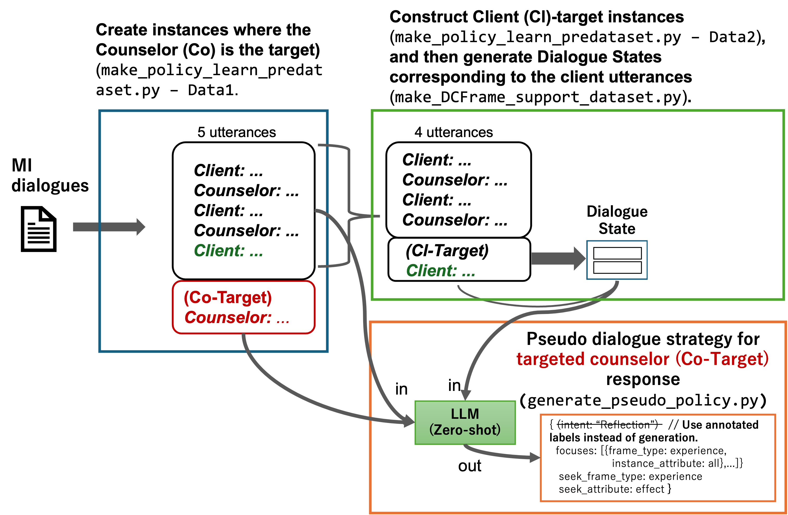

## Setup env
- This code uses [uv](https://docs.astral.sh/uv/).
```sh
# install uv (see https://docs.astral.sh/uv/getting-started/installation/)
# macOS and Linux
bash setup_uv.sh
# -> need to reload shell environment

# install dependencies
uv sync
```

## Running Inference (Dialogue Execution)
### [Use AnnoMI Dataset]
- Use five-session dialogue data from AnnoMI

#### Start the Dialogue policy pool server
- This module uses a GPU.
```sh
## install libraries
uv pip install protobuf sentencepiece tiktoken transformers torch --torch-backend=auto

## download text encoder model (markussagen/xlm-roberta-longformer-base-4096)
uv run python -m src.find_near_state.doc_embedding.embedding_xlm_r_multilingual
# -> save model & tokenizer in src/find_near_state/models/xlmrLong

uv run python -m src.find_near_state.find_near_DS_flask_server \
    --jsonl_dir /app/dataset/instance_jsonl/AnnoMI/policy/pseudo_policy_outdata/policyJudge_by_gpt4o-20240806/ \
    --embeddings_pkl /app/src/find_near_state/embedding_DB/AnnoMI_inst919_DSembeddings.pkl \
    --tokenizer_path /app/src/find_near_state/models/xlmrLong \
    --model_path /app/src/find_near_state/models/xlmrLong \
    --device cuda:0 \
    --host 127.0.0.1 --port 10800
```

### [AnnoMI] - Launch the dialogue system
- Modify the dialogue system config file.
    - src/DialogueSystems/sys_config_en_AnnoMI.yaml

- Launch the dialogue system
    ```sh
    # With the Dialogue policy pool server running, run the following in another terminal
    export OPENAI_API_KEY="..."
    uv run python -m src.DialogueSystems.run_dialogue_systems --config src/DialogueSystems/sys_config_en_AnnoMI.yaml
    ```


---

## Generating Custom Pseudo Dialogue Strategy

- Create a Pseudo Dialogue Strategy for Counselor utterances (Co-target) using the following 2-step approach.
- Preprocess Data: Create a json with speaker turns split.
- Prepare Data: Create two instances, Counselor target (Co-target, Data1) and Client target (Cl-target, Data2).
- Step1: Use Cl-target (Data2) to extract the Dialogue State for Client utterances.
- Step2: Use Co-target (Data1) and the Step1 result (Dialogue State) to generate the Pseudo Dialogue Strategy for Co-target.

### [AnnoMI]
#### [Preprocess Data] - Create session-json with speaker turns split
- Since the Pseudo Dialogue Strategy's intent uses the annotated intent labels (GT categories), place the csv with the 5-category annotations for AnnoMI's therapist utterances in `dataset/raw/AnnoMI_Co5category_annotated`.
- Obtain the AnnoMI full_csv ([AnnoMI](https://github.com/uccollab/AnnoMI)) and place it as `dataset/raw/AnnoMI_Co5category_annotated/AnnoMI-full.csv`.
```sh
uv run python -m src.make_dataset.convert_AnnoMI \
--raw_full_csv /app/dataset/raw/AnnoMI_Co5category_annotated/AnnoMI-full.csv \
--target_id 36 \
--annotated_csv /app/dataset/raw/AnnoMI_Co5category_annotated/AnnoMI_annotated_36.csv \
--out_json /app/dataset/json/AnnoMI/36.json
```

#### [Prepare Data (AnnoMI)] 
- Create the Counselor-Target instance (Data1) for extracting the Pseudo Dialogue Strategy, and the instance (Data2) for extracting the DCFrame from the immediately preceding Client utterance, which is needed when generating the Pseudo Dialogue Strategy.
```sh
uv run python -m src.decide_policy.make_policy_learn_predataset

# -> Output TgtCo: dataset/instance_jsonl/AnnoMI/policy/TgtCo/
# -> Output TgtCl: dataset/instance_jsonl/AnnoMI/policy/DCFrame_extracted_predata/
```

#### [Step1 (AnnoMI)] Create the Dialogue State for the Client utterance immediately preceding the Counselor-Target
```sh
# Edit config code in src/decide_policy/make_DCFrame_support_dataset.py - make_extracted_DCFrame_dataset_multisession()

# run
export OPENAI_API_KEY="..."
uv run python -m src.decide_policy.make_DCFrame_support_dataset
# -> Output 'dataset/instance_jsonl/AnnoMI/policy/DCFrame_support_dataset/'
```

#### [Step2 (AnnoMI)] Generate the Pseudo Dialogue Strategy for the Counselor-Target
```sh
# Edit generate_pseudo_policy.py and specify the session IDs to be extracted in get_multisession_pseudo_policy()

# run
uv run python -m src.decide_policy.generate_pseudo_policy
# -> Output '/app/dataset/instance_jsonl/AnnoMI/policy/pseudo_policy_outdata'
```

### [AnnoMI] - Build the server for retrieving neighboring Dialogue States and the following Counselor (Pseudo) Dialogue Strategy
#### Create the embedding DB of dialogue history + Dialogue State
- This module uses a GPU.
```sh
## install libraries
uv pip install protobuf sentencepiece tiktoken transformers torch --torch-backend=auto

## download text encoder model (markussagen/xlm-roberta-longformer-base-4096)
uv run python -m src.find_near_state.doc_embedding.embedding_xlm_r_multilingual
# -> save model & tokenizer in src/find_near_state/models/xlmrLong

## Create the DS(embedding)-Dialogue_Strategy Database
uv run python -m src.find_near_state.doc_embedding.create_embedding_controller \
    --src_tgt_policy_instances_dir /app/dataset/instance_jsonl/AnnoMI/policy/pseudo_policy_outdata/policyJudge_by_gpt4o-20240806/ \
    --tokenizer_path /app/src/find_near_state/models/xlmrLong \
    --model_path /app/src/find_near_state/models/xlmrLong \
    --device cuda:0 \
    --out_prefix AnnoMI
# -> save embedding.pkl in /app/src/find_near_state/embedding_DB/AnnoMI_inst919_DSembeddings.pkl
```

